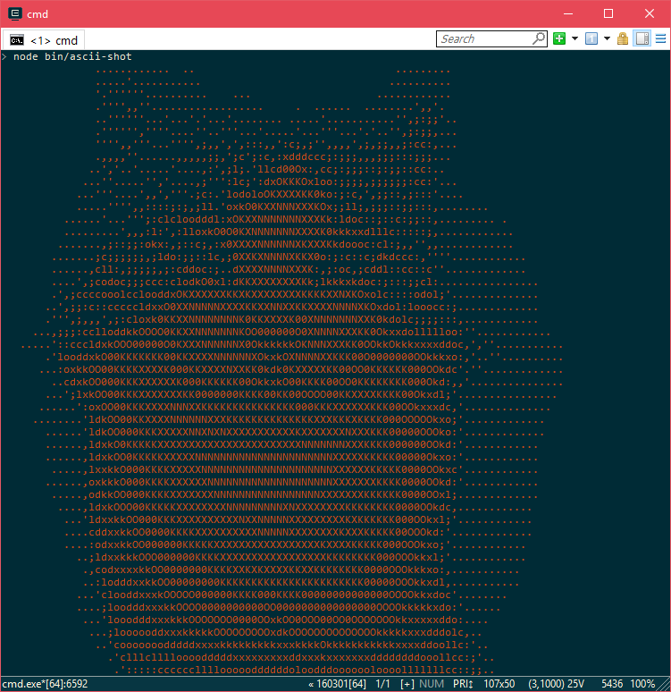

# Ascii-shot

:rainbow: Get an users instagram feed as an ASCII version to `stdout`.



## Installing

Install `ascii-shot` with `npm`

``` bash
npm install ascii-shot -g
```

## Usage

```
  Usage
    $ ascii-shot <username>

  Examples
    $ ascii-shot petetnt
```

And then use spacebar to fetch more images. Any other key will exit the program.

## License
MIT