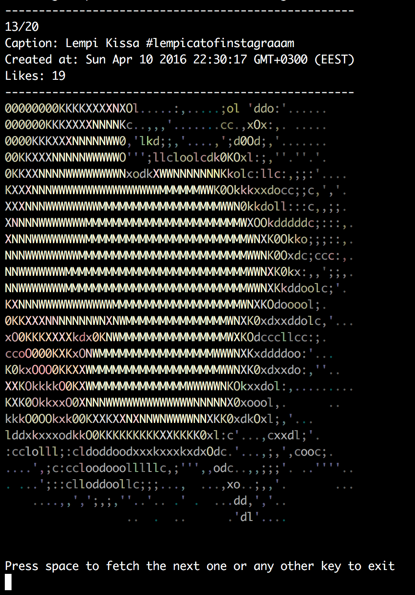

# asciiShot `ascii-shot`

:rainbow: Get an users Instagram feed as an ASCII version to `stdout`.



## Installing

Install `ascii-shot` with `npm`

``` bash
npm install ascii-shot -g
```

## Usage

```
    Usage
      $ ascii-shot <username>
      
    Options
      --highRes, -h Show highRes images
      --noColor, -c No colors

    Examples
      $ ascii-shot petetnt
      $ ascii-shot petetnt --highRes
      $ ascii-shot petetnt --noColor
```

And then use spacebar to fetch more images. Any other key will exit the program.

## License
MIT